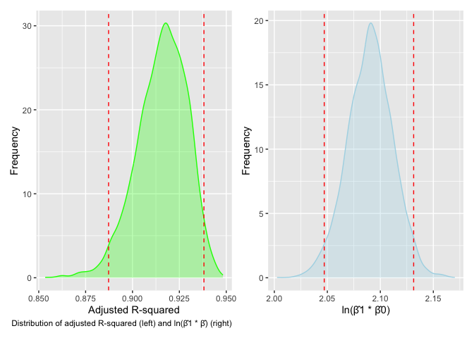

p8105_hw6_lt2949
================
Li Tian
2023-11-29

``` r
library(tidyverse)
```

    ## ── Attaching core tidyverse packages ──────────────────────── tidyverse 2.0.0 ──
    ## ✔ dplyr     1.1.3     ✔ readr     2.1.4
    ## ✔ forcats   1.0.0     ✔ stringr   1.5.0
    ## ✔ ggplot2   3.4.3     ✔ tibble    3.2.1
    ## ✔ lubridate 1.9.2     ✔ tidyr     1.3.0
    ## ✔ purrr     1.0.2     
    ## ── Conflicts ────────────────────────────────────────── tidyverse_conflicts() ──
    ## ✖ dplyr::filter() masks stats::filter()
    ## ✖ dplyr::lag()    masks stats::lag()
    ## ℹ Use the conflicted package (<http://conflicted.r-lib.org/>) to force all conflicts to become errors

``` r
library(patchwork)
library(modelr)
library(mgcv)
```

    ## Loading required package: nlme
    ## 
    ## Attaching package: 'nlme'
    ## 
    ## The following object is masked from 'package:dplyr':
    ## 
    ##     collapse
    ## 
    ## This is mgcv 1.8-42. For overview type 'help("mgcv-package")'.

## Problem1

## Problem2

``` r
#Download the data
weather_df <- 
  rnoaa::meteo_pull_monitors(
    c("USW00094728"),
    var = c("PRCP", "TMIN", "TMAX"), 
    date_min = "2022-01-01",
    date_max = "2022-12-31") |> 
  mutate(
    name = recode(id, USW00094728 = "CentralPark_NY"),
    tmin = tmin / 10,
    tmax = tmax / 10) |> 
  select(name, id, everything())
```

    ## using cached file: /Users/tian/Library/Caches/org.R-project.R/R/rnoaa/noaa_ghcnd/USW00094728.dly

    ## date created (size, mb): 2023-11-29 15:59:41.964875 (8.544)

    ## file min/max dates: 1869-01-01 / 2023-11-30

After loading the data, we clean it up

``` r
# selects relevant columns and renames Central Park to cp_ny for simplicity
strapped_weather_df <- weather_df %>% 
  select(name, tmax, tmin) %>% 
  mutate(
    name = str_replace(name, "CentralPark_NY", "cp_ny")
  ) %>% 
  bootstrap(n = 5000) %>%                                 
  mutate(
    model = map(strap, ~lm(tmax ~ tmin, data = .x)),     
    result = map(model, broom::tidy),                    
    stat = map(model, broom::glance)                    
  )

# a cleaned and filtered df containing variables of interest
clean_weather_strap <- strapped_weather_df %>% 
  select(-model, -strap) %>%                              # removed the original strap sample and model
  rename("strap_run" = .id) %>%                           
  unnest() %>%                                           
  select(strap_run, term, estimate, adj.r.squared) %>%   
  mutate(
    term = case_when(term == "(Intercept)" ~ "beta0",     # renamed intercept to beta0
                     term == "tmin" ~ "beta1",            # renamed slope to beta1
                     TRUE ~ as.character(term))
  ) %>% 
  pivot_wider(names_from = term,                         
              values_from = estimate) %>% 
  mutate(
    estimate_log = log(beta0 * beta1)                    
  ) %>% 
  janitor::clean_names()
```

    ## Warning: `cols` is now required when using `unnest()`.
    ## ℹ Please use `cols = c(result, stat)`.

After cleaning and bootstrapping, the `clean_weather_strap` dataset with
5000 records includes `adj_r_squared`, `beta0`, `beta1`, and
`estimate_log` for each bootstrap iteration (`strap_run`). We will
examine their distributions using density plots.

``` r
# density plot of r-squared with 2.5% and 97.5% quantile labeled
r_squared_plot <- clean_weather_strap %>% 
  ggplot(aes(x = adj_r_squared)) +
  geom_density(color = "green", fill = "green", alpha = 0.3) +
  geom_vline(xintercept = c(quantile(pull(clean_weather_strap, adj_r_squared), probs = 0.025),
                            quantile(pull(clean_weather_strap, adj_r_squared), probs = 0.975)),
             linetype = "dashed",
             color = "red") +
  labs(x = "Adjusted R-squared",
       y = "Frequency",
       caption = "Distribution of adjusted R-squared (left) and ln(β̂1 * β̂) (right)")

# density plot of ln(beta0 * beta1) with 2.5% and 97.5% quantile labeled
estimate_log_plot <- clean_weather_strap %>% 
  ggplot(aes(x = estimate_log)) +
  geom_density(color = "lightblue", fill = "lightblue", alpha = 0.3) +
  geom_vline(xintercept = c(quantile(pull(clean_weather_strap, estimate_log), probs = 0.025),
                            quantile(pull(clean_weather_strap, estimate_log), probs = 0.975)),
             linetype = "dashed",
             color = "red") +
  labs(x = "ln(β̂1 * β̂0)",
       y = "Frequency")

# use patchwork to print them side-by-side
r_squared_plot + estimate_log_plot
```

<!-- -->

The plot shows R-squared and log(beta0 \* beta1) as nearly normal
distributions, with a slight left skew in R-squared. The red dashed
lines denote the 2.5% and 97.5% quantiles from the `quantile()`
function.

``` r
# r-sq 95% CI
quantile(pull(clean_weather_strap, adj_r_squared), probs = c(0.025, 0.975))
```

    ##      2.5%     97.5% 
    ## 0.8853594 0.9384040

``` r
# est_log 95% CI
quantile(pull(clean_weather_strap, estimate_log), probs = c(0.025, 0.975))
```

    ##     2.5%    97.5% 
    ## 2.048874 2.132641

As such, we have a 95% CI of \[0.8853594, 0.938404\] for adjusted
R-squared and \[2.0488741 , 2.1326409\] for ln(β̂1 \* β̂0).
