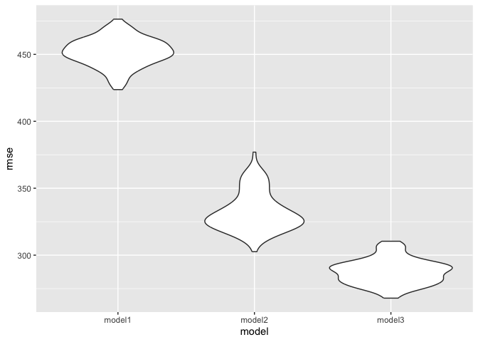

p8105_hw6_lt2949
================
Li Tian
2023-11-29

``` r
library(tidyverse)
```

    ## ── Attaching core tidyverse packages ──────────────────────── tidyverse 2.0.0 ──
    ## ✔ dplyr     1.1.3     ✔ readr     2.1.4
    ## ✔ forcats   1.0.0     ✔ stringr   1.5.0
    ## ✔ ggplot2   3.4.3     ✔ tibble    3.2.1
    ## ✔ lubridate 1.9.2     ✔ tidyr     1.3.0
    ## ✔ purrr     1.0.2     
    ## ── Conflicts ────────────────────────────────────────── tidyverse_conflicts() ──
    ## ✖ dplyr::filter() masks stats::filter()
    ## ✖ dplyr::lag()    masks stats::lag()
    ## ℹ Use the conflicted package (<http://conflicted.r-lib.org/>) to force all conflicts to become errors

``` r
library(patchwork)
library(modelr)
library(mgcv)
```

    ## Loading required package: nlme
    ## 
    ## Attaching package: 'nlme'
    ## 
    ## The following object is masked from 'package:dplyr':
    ## 
    ##     collapse
    ## 
    ## This is mgcv 1.8-42. For overview type 'help("mgcv-package")'.

## Problem1

``` r
library(tidyverse)
library(modelr)
```

In the data cleaning code below we create a `city_state` variable,
change `victim_age` to numeric, modifiy victim_race to have categories
white and non-white, with white as the reference category, and create a
`resolution` variable indicating whether the homicide is solved. Lastly,
we filtered out the following cities: Tulsa, AL; Dallas, TX; Phoenix,
AZ; and Kansas City, MO; and we retained only the variables
`city_state`, `resolution`, `victim_age`, `victim_sex`, and
`victim_race`.

``` r
homicide_df = 
  read_csv("homicide-data.csv", na = c("", "NA", "Unknown")) |> 
  mutate(
    city_state = str_c(city, state, sep = ", "),
    victim_age = as.numeric(victim_age),
    resolution = case_when(
      disposition == "Closed without arrest" ~ 0,
      disposition == "Open/No arrest"        ~ 0,
      disposition == "Closed by arrest"      ~ 1)
  ) |> 
  filter(victim_race %in% c("White", "Black")) |> 
  filter(!(city_state %in% c("Tulsa, AL", "Dallas, TX", "Phoenix, AZ", "Kansas City, MO"))) |> 
  select(city_state, resolution, victim_age, victim_sex, victim_race)
```

    ## Rows: 52179 Columns: 12
    ## ── Column specification ────────────────────────────────────────────────────────
    ## Delimiter: ","
    ## chr (8): uid, victim_last, victim_first, victim_race, victim_sex, city, stat...
    ## dbl (4): reported_date, victim_age, lat, lon
    ## 
    ## ℹ Use `spec()` to retrieve the full column specification for this data.
    ## ℹ Specify the column types or set `show_col_types = FALSE` to quiet this message.

Next we fit a logistic regression model using only data from Baltimore,
MD. We model `resolved` as the outcome and `victim_age`, `victim_sex`,
and `victim_race` as predictors. We save the output as `baltimore_glm`
so that we can apply `broom::tidy` to this object and obtain the
estimate and confidence interval of the adjusted odds ratio for solving
homicides comparing non-white victims to white victims.

``` r
baltimore_glm = 
  filter(homicide_df, city_state == "Baltimore, MD") |> 
  glm(resolution ~ victim_age + victim_sex + victim_race, family = binomial(), data = _)

baltimore_glm |> 
  broom::tidy() |> 
  mutate(
    OR = exp(estimate), 
    OR_CI_upper = exp(estimate + 1.96 * std.error),
    OR_CI_lower = exp(estimate - 1.96 * std.error)) |> 
  filter(term == "victim_sexMale") |> 
  select(OR, OR_CI_lower, OR_CI_upper) |>
  knitr::kable(digits = 3)
```

|    OR | OR_CI_lower | OR_CI_upper |
|------:|------------:|------------:|
| 0.426 |       0.325 |       0.558 |

Below, by incorporating `nest()`, `map()`, and `unnest()` into the
preceding Baltimore-specific code, we fit a model for each of the
cities, and extract the adjusted odds ratio (and CI) for solving
homicides comparing non-white victims to white victims. We show the
first 5 rows of the resulting dataframe of model results.

``` r
model_results = 
  homicide_df |> 
  nest(data = -city_state) |> 
  mutate(
    models = map(data, \(df) glm(resolution ~ victim_age + victim_sex + victim_race, 
                             family = binomial(), data = df)),
    tidy_models = map(models, broom::tidy)) |> 
  select(-models, -data) |> 
  unnest(cols = tidy_models) |> 
  mutate(
    OR = exp(estimate), 
    OR_CI_upper = exp(estimate + 1.96 * std.error),
    OR_CI_lower = exp(estimate - 1.96 * std.error)) |> 
  filter(term == "victim_sexMale") |> 
  select(city_state, OR, OR_CI_lower, OR_CI_upper)

model_results |>
  slice(1:5) |> 
  knitr::kable(digits = 3)
```

| city_state      |    OR | OR_CI_lower | OR_CI_upper |
|:----------------|------:|------------:|------------:|
| Albuquerque, NM | 1.767 |       0.831 |       3.761 |
| Atlanta, GA     | 1.000 |       0.684 |       1.463 |
| Baltimore, MD   | 0.426 |       0.325 |       0.558 |
| Baton Rouge, LA | 0.381 |       0.209 |       0.695 |
| Birmingham, AL  | 0.870 |       0.574 |       1.318 |

Below we generate a plot of the estimated ORs and CIs for each city,
ordered by magnitude of the OR from smallest to largest. From this plot
we see that most cities have odds ratios that are smaller than 1,
suggesting that crimes with male victims have smaller odds of resolution
compared to crimes with female victims after adjusting for victim age
and race. This disparity is strongest in New yrok. In roughly half of
these cities, confidence intervals are narrow and do not contain 1,
suggesting a significant difference in resolution rates by sex after
adjustment for victim age and race.

``` r
model_results |> 
  mutate(city_state = fct_reorder(city_state, OR)) |> 
  ggplot(aes(x = city_state, y = OR)) + 
  geom_point() + 
  geom_errorbar(aes(ymin = OR_CI_lower, ymax = OR_CI_upper)) + 
  theme(axis.text.x = element_text(angle = 90, hjust = 1))
```

<!-- -->

## Problem2

``` r
#Download the data
weather_df <- 
  rnoaa::meteo_pull_monitors(
    c("USW00094728"),
    var = c("PRCP", "TMIN", "TMAX"), 
    date_min = "2022-01-01",
    date_max = "2022-12-31") |> 
  mutate(
    name = recode(id, USW00094728 = "CentralPark_NY"),
    tmin = tmin / 10,
    tmax = tmax / 10) |> 
  select(name, id, everything())
```

    ## using cached file: /Users/tian/Library/Caches/org.R-project.R/R/rnoaa/noaa_ghcnd/USW00094728.dly

    ## date created (size, mb): 2023-11-29 15:59:41.964875 (8.544)

    ## file min/max dates: 1869-01-01 / 2023-11-30

After loading the data, we clean it up

``` r
# selects relevant columns and renames Central Park to cp_ny for simplicity
strapped_weather_df <- weather_df %>% 
  select(name, tmax, tmin) %>% 
  mutate(
    name = str_replace(name, "CentralPark_NY", "cp_ny")
  ) %>% 
  bootstrap(n = 5000) %>%                                 
  mutate(
    model = map(strap, ~lm(tmax ~ tmin, data = .x)),     
    result = map(model, broom::tidy),                    
    stat = map(model, broom::glance)                    
  )

# a cleaned and filtered df containing variables of interest
clean_weather_strap <- strapped_weather_df %>% 
  select(-model, -strap) %>%                              # removed the original strap sample and model
  rename("strap_run" = .id) %>%                           
  unnest() %>%                                           
  select(strap_run, term, estimate, adj.r.squared) %>%   
  mutate(
    term = case_when(term == "(Intercept)" ~ "beta0",     # renamed intercept to beta0
                     term == "tmin" ~ "beta1",            # renamed slope to beta1
                     TRUE ~ as.character(term))
  ) %>% 
  pivot_wider(names_from = term,                         
              values_from = estimate) %>% 
  mutate(
    estimate_log = log(beta0 * beta1)                    
  ) %>% 
  janitor::clean_names()
```

    ## Warning: `cols` is now required when using `unnest()`.
    ## ℹ Please use `cols = c(result, stat)`.

After cleaning and bootstrapping, the `clean_weather_strap` dataset with
5000 records includes `adj_r_squared`, `beta0`, `beta1`, and
`estimate_log` for each bootstrap iteration (`strap_run`). We will
examine their distributions using density plots.

``` r
# density plot of r-squared with 2.5% and 97.5% quantile labeled
r_squared_plot <- clean_weather_strap %>% 
  ggplot(aes(x = adj_r_squared)) +
  geom_density(color = "green", fill = "green", alpha = 0.3) +
  geom_vline(xintercept = c(quantile(pull(clean_weather_strap, adj_r_squared), probs = 0.025),
                            quantile(pull(clean_weather_strap, adj_r_squared), probs = 0.975)),
             linetype = "dashed",
             color = "red") +
  labs(x = "Adjusted R-squared",
       y = "Frequency",
       caption = "Distribution of adjusted R-squared (left) and ln(β̂1 * β̂) (right)")

# density plot of ln(beta0 * beta1) with 2.5% and 97.5% quantile labeled
estimate_log_plot <- clean_weather_strap %>% 
  ggplot(aes(x = estimate_log)) +
  geom_density(color = "lightblue", fill = "lightblue", alpha = 0.3) +
  geom_vline(xintercept = c(quantile(pull(clean_weather_strap, estimate_log), probs = 0.025),
                            quantile(pull(clean_weather_strap, estimate_log), probs = 0.975)),
             linetype = "dashed",
             color = "red") +
  labs(x = "ln(β̂1 * β̂0)",
       y = "Frequency")

# use patchwork to print them side-by-side
r_squared_plot + estimate_log_plot
```

<!-- -->

The plot shows R-squared and log(beta0 \* beta1) as nearly normal
distributions, with a slight left skew in R-squared. The red dashed
lines denote the 2.5% and 97.5% quantiles from the `quantile()`
function.

``` r
# r-sq 95% CI
quantile(pull(clean_weather_strap, adj_r_squared), probs = c(0.025, 0.975))
```

    ##      2.5%     97.5% 
    ## 0.8872561 0.9381072

``` r
# est_log 95% CI
quantile(pull(clean_weather_strap, estimate_log), probs = c(0.025, 0.975))
```

    ##     2.5%    97.5% 
    ## 2.047080 2.131435

As such, we have a 95% CI of \[0.8872561, 0.9381072\] for adjusted
R-squared and \[2.0470798 , 2.131435\] for ln(β̂1 \* β̂0).

## Problem3

``` r
birthweight_df = 
  read_csv("birthweight.csv") %>% 
  janitor::clean_names() %>% 
  mutate(
    babysex = as.factor(babysex),
    frace = as.factor(frace),
    malform = as.factor(malform),
    mrace = as.factor(mrace)
  ) 
```

    ## Rows: 4342 Columns: 20
    ## ── Column specification ────────────────────────────────────────────────────────
    ## Delimiter: ","
    ## dbl (20): babysex, bhead, blength, bwt, delwt, fincome, frace, gaweeks, malf...
    ## 
    ## ℹ Use `spec()` to retrieve the full column specification for this data.
    ## ℹ Specify the column types or set `show_col_types = FALSE` to quiet this message.

``` r
birthweight_df
```

    ## # A tibble: 4,342 × 20
    ##    babysex bhead blength   bwt delwt fincome frace gaweeks malform menarche
    ##    <fct>   <dbl>   <dbl> <dbl> <dbl>   <dbl> <fct>   <dbl> <fct>      <dbl>
    ##  1 2          34      51  3629   177      35 1        39.9 0             13
    ##  2 1          34      48  3062   156      65 2        25.9 0             14
    ##  3 2          36      50  3345   148      85 1        39.9 0             12
    ##  4 1          34      52  3062   157      55 1        40   0             14
    ##  5 2          34      52  3374   156       5 1        41.6 0             13
    ##  6 1          33      52  3374   129      55 1        40.7 0             12
    ##  7 2          33      46  2523   126      96 2        40.3 0             14
    ##  8 2          33      49  2778   140       5 1        37.4 0             12
    ##  9 1          36      52  3515   146      85 1        40.3 0             11
    ## 10 1          33      50  3459   169      75 2        40.7 0             12
    ## # ℹ 4,332 more rows
    ## # ℹ 10 more variables: mheight <dbl>, momage <dbl>, mrace <fct>, parity <dbl>,
    ## #   pnumlbw <dbl>, pnumsga <dbl>, ppbmi <dbl>, ppwt <dbl>, smoken <dbl>,
    ## #   wtgain <dbl>

``` r
purrr::map(birthweight_df, ~ sum(is.na(.)))
```

    ## $babysex
    ## [1] 0
    ## 
    ## $bhead
    ## [1] 0
    ## 
    ## $blength
    ## [1] 0
    ## 
    ## $bwt
    ## [1] 0
    ## 
    ## $delwt
    ## [1] 0
    ## 
    ## $fincome
    ## [1] 0
    ## 
    ## $frace
    ## [1] 0
    ## 
    ## $gaweeks
    ## [1] 0
    ## 
    ## $malform
    ## [1] 0
    ## 
    ## $menarche
    ## [1] 0
    ## 
    ## $mheight
    ## [1] 0
    ## 
    ## $momage
    ## [1] 0
    ## 
    ## $mrace
    ## [1] 0
    ## 
    ## $parity
    ## [1] 0
    ## 
    ## $pnumlbw
    ## [1] 0
    ## 
    ## $pnumsga
    ## [1] 0
    ## 
    ## $ppbmi
    ## [1] 0
    ## 
    ## $ppwt
    ## [1] 0
    ## 
    ## $smoken
    ## [1] 0
    ## 
    ## $wtgain
    ## [1] 0

This dataset contains 4342 rows and 20 columns, there is no missing
data.  

According to a Wikipedia
page\[<https://en.wikipedia.org/wiki/Low_birth_weight>\] on low birth
weight, certain maternal risk factors like younger age, higher parity,
and a history of low birth weight (LBW) infants can influence a baby’s
birth weight. Based on this information, I incorporated mother’s age,
number of previous live births, and the count of past LBW infants into
the model.

The duration of gestation and the presence of malformations are also
intuitively connected to birthweight, hence their inclusion in the
model.

Additionally, I wanted to explore the impact of sociodemographic factors
on birthweight, leading to the inclusion of the mother’s race and family
income as variables.

``` r
model_fit_1 = lm(bwt ~ gaweeks + momage + mrace + malform + parity + fincome + pnumlbw, data = birthweight_df)

birthweight_df %>% 
  modelr::add_residuals(model_fit_1) %>%
  modelr::add_predictions(model_fit_1) %>% 
  ggplot(aes(x = pred, y = resid)) + 
  geom_point(alpha = 0.3) +
  geom_smooth(se = F, color = "red", method = "lm")
```

    ## `geom_smooth()` using formula = 'y ~ x'

<!-- -->

``` r
  labs(
    title = "Predicted vs. Residuals",
    x = "Predicted",
    y = "Residuals"
    ) +
  theme(plot.title = element_text(hjust = 0.5))
```

    ## NULL

``` r
# Fit models
model_2 = lm(bwt ~ gaweeks + blength, data = birthweight_df)
model_3 = lm(bwt ~ bhead + blength + babysex + bhead * blength + bhead * babysex + blength * babysex + bhead * blength * babysex, data = birthweight_df)
```

``` r
# Cross validation
cv_df = 
  crossv_mc(birthweight_df, 100) %>% 
  mutate(
    train = map(train, as_tibble),
    test = map(test, as_tibble)
  )

cv_df = 
  cv_df %>% 
  mutate(
   model_fit_1 = map(.x = train, ~lm(bwt ~ gaweeks + momage + mrace + malform + parity + fincome + pnumlbw, data = .x)),
   model_2 = map(.x = train, ~lm(bwt ~ gaweeks + blength, data = .x)),
   model_3 = map(.x = train, ~lm(bwt ~ bhead + blength + babysex + bhead * blength + bhead * babysex + blength * babysex + bhead * blength * babysex, data = .x))
  ) %>% 
  mutate(
    rmse_model1 = map2_dbl(.x = model_fit_1, .y = test, ~rmse(model = .x, data = .y)),
    rmse_model2 = map2_dbl(.x = model_2, .y = test, ~rmse(model = .x, data = .y)),
    rmse_model3 = map2_dbl(.x = model_3, .y = test, ~rmse(model = .x, data = .y))
  )
```

    ## Warning: There were 4 warnings in `mutate()`.
    ## The first warning was:
    ## ℹ In argument: `rmse_model1 = map2_dbl(.x = model_fit_1, .y = test, ~rmse(model
    ##   = .x, data = .y))`.
    ## Caused by warning in `predict.lm()`:
    ## ! prediction from rank-deficient fit; attr(*, "non-estim") has doubtful cases
    ## ℹ Run `dplyr::last_dplyr_warnings()` to see the 3 remaining warnings.

``` r
# Violin plots 
cv_df %>% 
  select(starts_with("rmse")) %>% 
  pivot_longer(
    everything(),
    names_to = "model",
    values_to = "rmse",
    names_prefix = "rmse_"
  ) %>% 
  ggplot(aes(x = model, y = rmse)) +
  geom_violin()
```

<!-- -->

The RMSE plot reveals that out of the three models tested, Model 3
performs the best, evidenced by its lowest RMSE value. Contrary to
expectations, Model 1, which was informed by information from Wikipedia,
did not align well with the data, suggesting that Wikipedia may not be a
reliable source for this purpose.

Model 3 encompasses variables such as head circumference, length, and
sex, along with all their interaction terms, including the three-way
interaction among them.
